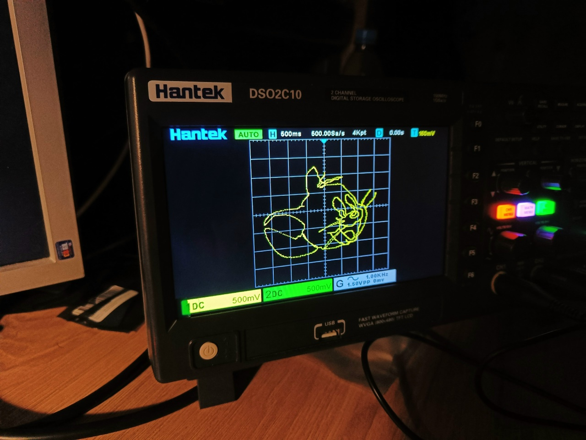
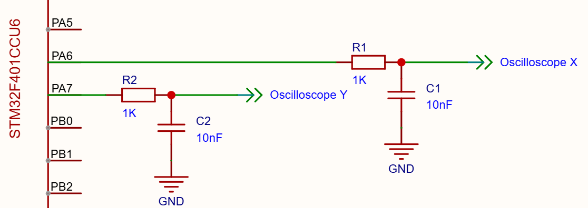

# Рисование на осциллографе с помощью микроконтроллера STM32F401CCU6

Программа для получения изображений на экране двухканального осциллографа. Напряжение осей X и Y формируется 137-и кГц ШИМ.

---
## Схема подключения

Для фильтрации ШИМ сигнала достаточно использовать RC-фильтр с частотой среза 16 кГц.

